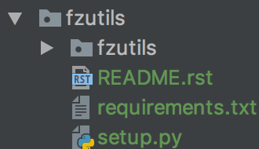

## 动态语言的定义:
它是一类在运行时可以改变其结构的语言：eg.新函数, 新对象, 甚至新的代码可以被引进, 已有的函数可以被删除或其它结构商的变化
动态语言目前非常具有活力, 这就是动态语言的魅力和坑! eg. 动态给实例绑定属性

## input()与raw_input()区别
```
14.3.5 input()
内建函数input()是eval()和raw_input()的组合，等价于eval(raw_input())。类似于
raw_input()，input()有一个可选的参数，该参数代表了给用户的字符串提示。如果不给定参数的
话，该字符串默认为空串。
从功能上看,input 不同于raw_input()，因为raw_input()总是以字符串的形式，逐字地返回用
户的输入。input()履行相同的的任务；而且，它还把输入作为python 表达式进行求值。这意味着
input()返回的数据是对输入表达式求值的结果：一个python 对象。
```

## xrange()与range()
```
8.6.5 xrange() 内建函数
xrange() 类似 range() , 不过当你有一个很大的范围列表时, xrange() 可能更为适合, 因为
它不会在内存里创建列表的完整拷贝. 它只被用在 for 循环中, 在 for 循环外使用它没有意义。
同样地, 你可以想到, 它的性能远高出 range(), 因为它不生成整个列表。
```

## python中%r和%s的区别
```
%r用repr()方法处理对象
%s用str()方法处理对象
>>> import datetime
>>> d = datetime.date.today()
>>> print "%s" % d
2015-10-30
>>> print "%r" % d
datetime.date(2015, 10, 30)
```

## print语句换行
```
print 语句默认在输出内容末尾后加一个换行符, 而在语句后加一个逗号就可以避免这个行为。
print 语句改为print('', end='')
```

## 网络编程 - 655页
```
662页说：
from socket import * 比 import socket 化简代码
tcpSock = socket.socket(socket.AF_INET, socket.SOCK_STREAM)
化简为
tcpSock = socket(AF_INET, SOCK_STREAM)
[典型的通用服务端伪代码]：
    ss = socket()       # 创建服务器套接字
    ss.bind()           # 把地址绑定到套接字上
    ss.listen()         # 监听连接
    inf_loop:           # 服务器无限循环
    cs = ss.accept()    # 接受客户的连接
    comm_loop:          # 通讯循环
    cs.recv()/cs.send() # 对话（接收与发送）
    cs.close()          # 关闭客户套接字
    ss.close()          # 关闭服务器套接字（可选）
[典型的通用客户端伪代码]：
    cs = socket()       # 创建客户套接字
    cs.connect()        # 尝试连接服务器
    comm_loop:          # 通讯循环
    cs.send()/cs.recv() # 对话（发送／接收）
    cs.close()          # 关闭客户套接字
```

## 单网卡绑定多IP的实现方法
```
$ sudo su
# ifconfig eth0:1 192.168.2.100 netmask 255.255.255.0
# ifconfig eth0:2 192.168.2.200 netmask 255.255.255.0
网络重启后以上配置失效
# service networking restart
如需加入开机启动项
$ sudo subl /etc/rc.local
在exit 0前面 添加以上两句配置
```

## Python 对象之间赋值

Python 中的对象之间赋值时是按引用传递的，如果需要拷贝对象，需要使用标准库中的 copy 模块。
1. copy.copy 浅拷贝 只拷贝父对象，不会拷贝对象的内部的子对象。
2. copy.deepcopy 深拷贝 拷贝对象及其子对象。


## 关于自定义模块相对路径引入报错
```
(.env)afa@afahost:~/code/flask_project$ python app/tools/db.py
Traceback (most recent call last):
  File "app/tools/db.py", line 13, in <module>
    from ..database import db_session
ValueError: Attempted relative import in non-package
```
原因分析: from ..database import db_session 这样的写法是显式相对引用, 这种引用方式只能用于 package 中, 而不能用于主模块中。
因为主 module 的 name 总是为 main , 并没有层次结构, 也就无从谈起相对引用了。
换句话, if __name__=="__main__": 和相对引用是不能并存的。

## __builtins__ 和__builtin__
这两个模块不能混淆, __builtins__包含内建名称空间中内建名字的集合
其中大多数来自__builtin__模块, 该模块包含内建函数,异常以及其他属性

## globals()和locals()
分别返回调用者全局和局部名称空间的字典
在一个函数内部,局部名称空间代表在函数执行时候定义的所有名字
locals()就是返回这些名字的字典  global()返回函数可访问的全局的名字

## python怎么编译pyc文件
$ python -m compile xxx.py      对当前目录下的xxx.py文件生成pyc

## python语法允许你在源码中把几个字符串连在一起来构成新字符串

eg:
>>> f = 'hello' 'world'
>>> f
'helloworld'

>>> f = urllib.urlopen('http://'
... 'localhost'
... ':8000'
... '/test/test.py')

如你所想的, 下面就是urlopen()方法所得到的真实输入
>>> 'http://' 'localhost' ':8000' '/test/test.py'
http://localhost:8000/test/test.py

## python复数的概念
1. 复数不能单独存在, 它们总是和一个值为0.0的实数部分一起来构成复数
2. 复数由实数部分跟虚数部分构成
3. 表示虚数的语法: real+imagj
4. 实数部分和虚数部分都是浮点型
6. 虚数部分必须有后缀j或J

>>> aComplex = -8.3-1.2j
>>> aComplex
(-8.3-1.2j)
>>> aComplex.real
-8.3
>>> aComplex.imag
-1.2
>>> aComplex.conjugate()
(-8.3+1.2j)
>>> complex(4)
(4+0j)
>>> complex(2.4, -8)
(2.4-8j)
>>> complex(2.3e-10, 45.3e4)
(2.3e-10+453000j)

## '_'存储最近的表达式, 它是非常有用的
```python
>>> 1 + 1
2
>>> _
2
```
```python
>>> import math
>>> math.pi / 3
1.0471975511965976
>>> angle = _
>>> math.cos(angle)
0.50000000000000011
>>> _
0.50000000000000011
```

## 关于元组注意点
```puthon
>>> 1,
(1,)
>>> (1,)
(1,)
>>> ()
()
>>> tuple()
()
>>> value = 1,
>>> value
(1,)
```

## 哪里可能使用in
Good:
```
for key in d:
    print key
```
in is generally faster.
This pattern also works for items in arbitrary containers (such as lists, tuples, and sets).
in is also an operator (as we'll see).
Bad:
```
for key in d.keys():
    print key
```
This is limited to objects with a keys() method.

For consistency, use key in dict, not dict.has_key():

do this:
```python
if key in d:
    ...do something with d[key]
```
not this:
```python
if d.has_key(key):
    ...do something with d[key]
```
This usage of in is as an operator.

## 学会常用dict的get()方法
This is the naïve way to do it:
```python
navs = {}
for (portfolio, equity, position) in data:
    if portfolio not in navs:
        navs[portfolio] = 0
    navs[portfolio] += position * prices[equity]
```
dict.get(key, default) removes the need for the test:
```python
navs = {}
for (portfolio, equity, position) in data:
    navs[portfolio] = (navs.get(portfolio, 0)
                       + position * prices[equity])
```
Much more direct.

## 常用dict的setdefault()方法
Here we have to initialize mutable dictionary values. Each dictionary value will be a list. This is the naïve way:
Initializing mutable dictionary values:
```python
equities = {}
for (portfolio, equity) in data:
    if portfolio in equities:
        equities[portfolio].append(equity)
    else:
        equities[portfolio] = [equity]
```
dict.setdefault(key, default) does the job更有效率的:
```python
equities = {}
for (portfolio, equity) in data:
    equities.setdefault(portfolio, []).append(
                                         equity)
```
dict.setdefault() 等价于 "get, or set & get". Or "set if necessary, then get". It's especially efficient if your dictionary key is expensive to compute or long to type.
dict.setdefault()有返回值, 返回的是原先key对应的value

## 在python3中解决打开文件编码报ascii问题(UnicodeEncodeError: 'ascii' codec can't encode characters in position 2-5)
```python
my_file = open('./duanzi.txt', 'a+', encoding='utf-8')  # 这样打开能解决报错:UnicodeEncodeError: 'ascii' codec can't encode characters in position 2-5: ordinal not in range(128)
```

## pypi自发包(更新)
```shell
# 现在从setup.py位于的同一目录运行此命令
python3 setup.py sdist bdist_wheel

# --skip-existing 避免400包已存在错误
twine upload dist/* --skip-existing     

# 更新本地包
pip3 install -U fzutils 
```

#### 注意层级, fzutils才能被导入(结构如下图)



## * pycharm 的lincese server认证
```html
地址: http://idea.imsxm.com
```